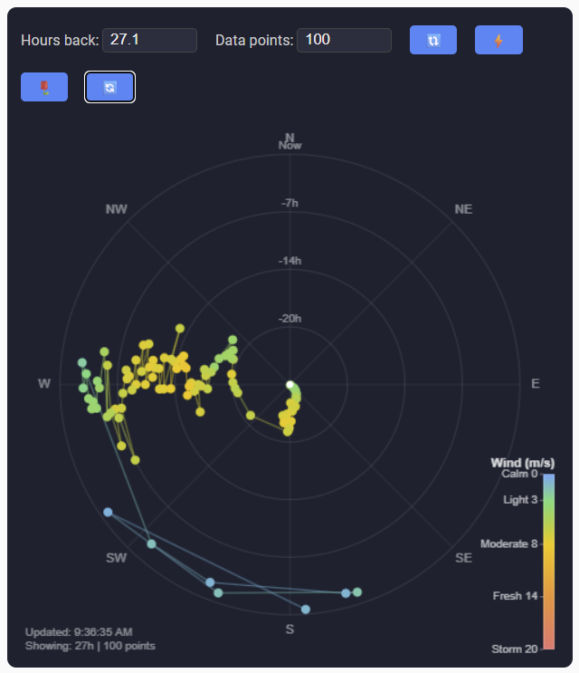
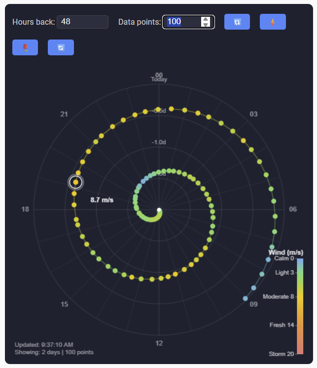
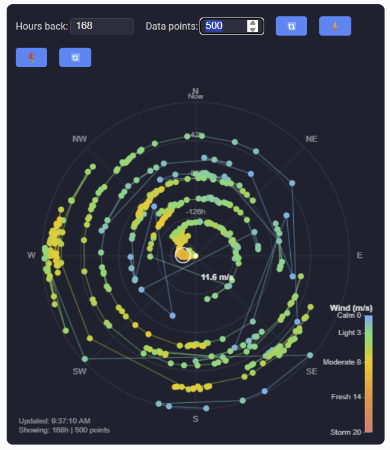

# polar-chart

A Home Assistant Lovelace custom card that displays wind history as a polar spiral.
Wind direction determines the angle, time determines the radius (center = oldest, edge = now),
and wind speed determines the color of each data point.

Beyond wind, the card works for any two HA sensors and any time window from
30 minutes up to 7 days — making it a natural fit for 24-hour overviews or
multi-day patterns where you want to see at a glance how a value (temperature,
humidity, power, anything numeric) has developed over one or several days.

## Screenshots

| Spiral, ~27h | Daily pattern, 48h | Full 7 days, 500 points |
|---|---|---|
|  |  |  |

## Features

- **Polar spiral** visualization with compass rose
- **Daily pattern view** (`view_mode: daily` or 🔄 button) — angle = hour-of-day, radius = days back, for spotting recurring daily wind patterns
- **Continuous color gradient** between 5 anchor points based on wind speed
- **Wind rose overlay** (🌹 toggle) — sector frequency distribution behind the spiral
- **Max wind marker** (⚡ toggle) — animated ring + label on the strongest measurement in view
- **Mouse wheel zoom** — scroll in for higher resolution, scroll out for up to 7 days
- **Progressive loading** — fast initial render, full 7-day cache filled in background
- **Auto-detect** of language (from HA locale) and speed unit (from sensor `unit_of_measurement`)
- **No token in YAML** — auth comes from the Lovelace `hass` object

## Installation

### 1. Copy the card file to Home Assistant

```bash
scp polar-chart.js hassio:/config/www/
```

(Replace `hassio` with your own SSH alias / `user@host:path`, or copy via Samba / HA File Editor.)

### 2. Register as a Lovelace resource

In Home Assistant: **Settings → Dashboards → (three-dot menu) → Resources → Add resource**

| Field | Value |
|-------|-------|
| URL   | `/local/polar-chart.js?v=1` |
| Type  | JavaScript module |

The `?v=1` suffix lets you bypass aggressive browser cache after deploys — bump it to `?v=2`, `?v=3`, etc. each time the JS changes.

Reload the browser after adding the resource.

### 3. Add the card to a dashboard

In Lovelace, add a new card and choose **Manual** (YAML editor), then paste:

```yaml
type: custom:polar-chart
bearing_sensor: sensor.your_wind_bearing
speed_sensor: sensor.your_wind_strength
```

That's the minimum — everything else is optional.

## Configuration

| Key              | Required | Default       | Description |
|------------------|----------|---------------|-------------|
| `bearing_sensor` | ✅ (see note) | —        | Entity ID for wind direction (degrees 0–360). **Optional when `view_mode: daily`** — daily mode derives the angle from the timestamp's hour and doesn't need a direction sensor. |
| `speed_sensor`   | ✅       | —             | Entity ID for wind speed |
| `hours`          | ❌       | `12`          | Initial time window in hours |
| `num_points`     | ❌       | `100`         | Number of buckets for the rebucketed display |
| `speed_unit`     | ❌       | auto-detect   | Override sensor unit. Allowed: `m/s`, `km/h`, `mph`, `knop` |
| `language`       | ❌       | auto-detect   | UI language. Allowed: `sv`, `en`. Defaults to HA locale, falls back to `sv` |
| `view_mode`      | ❌       | `spiral`      | Initial view: `spiral` or `daily` |
| `refresh_interval` | ❌     | `10`          | Auto-refresh interval in minutes. Minimum `1` |

The card uses the `hass` object that Lovelace already injects, so you don't need
`ha_url` or `ha_token` in the config.

## Generic config (any two sensors)

The wind keys above (`bearing_sensor` / `speed_sensor`) are a shorthand. The card
also accepts a generic form that works for any pair of sensors — angle determines
the angular position, color is optional and determines the dot color via a
configurable palette.

```yaml
type: custom:polar-chart
angle:
  sensor: sensor.x                # required
  min: 0                          # required, value at angle 0
  max: 360                        # required, value at full circle
  cyclic: true                    # required, true if min and max are the same direction
  labels:                         # optional, value → label map for compass labels
    0: "N"
    90: "E"
    180: "S"
    270: "W"
color:                            # optional — omit for monochrome dots
  sensor: sensor.y                # required if color block is present
  min: 0                          # required, value at the bottom of the gradient
  max: 100                        # required, value at the top
  unit: "%"                       # optional, shown in legend header
  palette:                        # required, at least 2 entries
    - { value: 0,   color: "#60a5fa" }
    - { value: 50,  color: "#facc15" }
    - { value: 100, color: "#f87171" }
  legend:                         # optional override for tick labels
    - { value: 0,   label: "Low"  }
    - { value: 50,  label: "Med"  }
    - { value: 100, label: "High" }
refresh_interval: 10              # optional, see table above
```

**Palette notes:**
- Any number of stops ≥ 2 — colors interpolate smoothly between adjacent anchors.
- Each stop becomes a tick mark on the legend (override with `legend:` if needed).
- Values below the first stop are clamped to its color; values above the last
  stop are clamped to the last color.

**`cyclic` semantics:**
- `cyclic: true` — the axis wraps (e.g. compass: 0° and 360° are the same direction).
- `cyclic: false` — the axis is open-ended (e.g. 0–100% humidity), drawn with a
  small gap at the top so min and max are visually distinct.

The wind-rose overlay is only available for full 0–360 cyclic angle axes, and
the daily-pattern view is only available for the legacy wind config.

## Color scale

Speed is mapped via a smooth gradient between 5 anchor points (no hard steps).
Color thresholds are always evaluated in m/s; legend tick values are converted
to your configured unit at draw time.

| Color  | Speed (m/s) | Label (sv / en)        |
|--------|-------------|------------------------|
| 🔵 Blue   | 0     | Lugnt / Calm        |
| 🟢 Green  | 3     | Lätt / Light        |
| 🟡 Yellow | 8     | Måttligt / Moderate |
| 🟠 Orange | 14    | Friskt / Fresh      |
| 🔴 Red    | 20+   | Hård vind / Storm   |

## Usage

- **🔃 Uppdatera / Update** — re-fetch from HA and redraw
- **⚡ pw-maxwind** — toggle the max-wind marker (with pulse animation)
- **🌹 pw-windrose** — toggle the wind-rose frequency overlay
- **🔄 pw-mode** — toggle between spiral and daily-pattern mode
- **Hours / Datapoints inputs** — change time window or bucket count
- **Mouse wheel** on the canvas — zoom in/out (0.5h to 168h)
- **Auto-refresh** every 10 minutes

## Development

```bash
git clone git@github.com:emilgil/polar-chart.git
cd polar-chart
claude   # start Claude Code, or edit the JS directly
```

To deploy after changes:

```bash
scp polar-chart.js hassio:/config/www/
```

Then hard-reload the browser (Ctrl+F5 or Shift+F5) and bump the `?v=` suffix
on the Lovelace resource to bypass cache.
